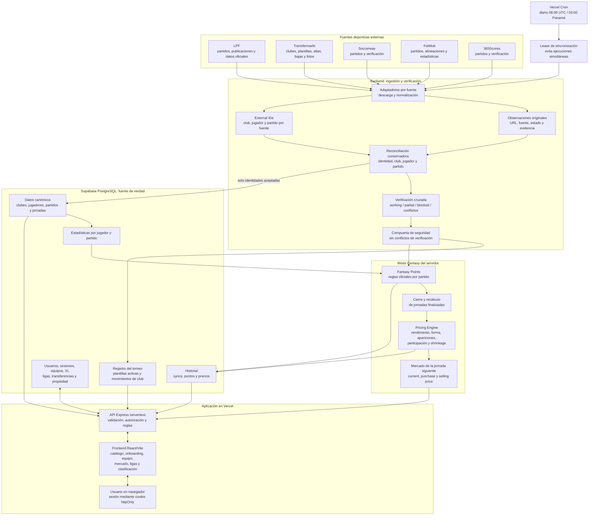

# Flujo actual de Fantasy LPF

## Recorrido de una actualización deportiva

1. Vercel ejecuta `/api/cron/sync` una vez al día y valida su firma secreta.
2. Un lease en PostgreSQL impide que dos sincronizaciones modifiquen los datos simultáneamente.
3. Los adaptadores consultan LPF, Transfermarkt, Soccerway, FotMob y 365Scores desde el servidor.
4. Se conservan las observaciones de cada fuente y sus identificadores externos.
5. El reconciliador relaciona jugadores, clubes y partidos sin unir identidades ambiguas.
6. Las identidades reconciliadas y aceptadas se guardan en el catálogo; las ambiguas quedan como evidencia y conflicto.
7. Si la verificación detecta conflictos, el flujo se detiene antes de actualizar el registro del torneo o recalcular la economía.
8. Se recalculan los puntos Fantasy de las jornadas finalizadas.
9. El Pricing Engine calcula los precios siguientes y guarda su historial de forma idempotente.
10. La API entrega al frontend los precios, puntos y datos persistidos en Supabase.

## Recorrido de una acción del usuario

1. React carga el catálogo público desde la API.
2. Registro e inicio de sesión crean una sesión persistente mediante cookie `httpOnly`.
3. Onboarding, alineaciones, ligas y transferencias se envían a la API.
4. El backend comprueba presupuesto, posiciones, máximo por club, deadline, transferencias gratuitas, penalizaciones y precios.
5. PostgreSQL guarda la operación y el frontend vuelve a leer el estado confirmado por el servidor.

El frontend no calcula de forma autoritativa los puntos, el precio actual, el precio de venta ni el precio de compra.
